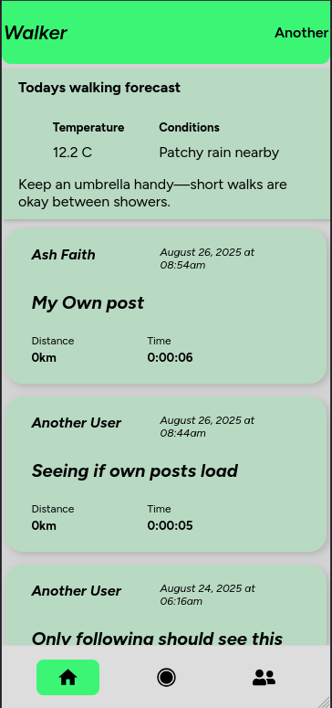
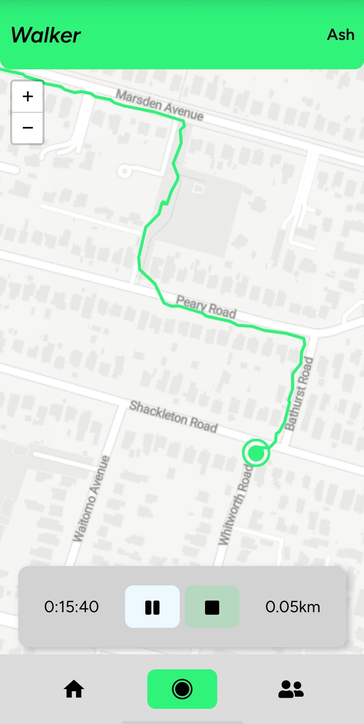
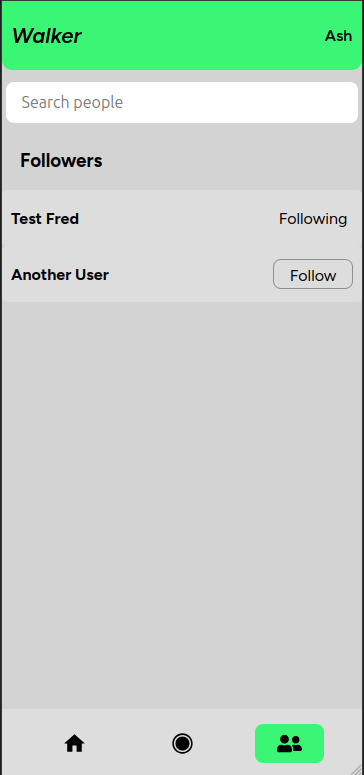

 

  <h3 align="center">Walker</h3>

  

    An app for tracking walks with your four legged friend
    

<!-- ABOUT THE PROJECT -->

## About The Project

Walker was created as a clone of popular activity trackers (think Strava, Nike Run Club) with a focus around dog walks.

The app let's you follow friends and see their activity too so you can keep up to date with all your favourite pups.

(<a href="#readme-top">back to top</a>)

### Built With

- [![React][React.js]][React-url]
- [![Vite][vite.dev]][vite-url]
- [![Node.js][nodejs.org]][nodejs-url]
- [![Express.js][expressjs.com]][expressjs-url]

(<a href="#readme-top">back to top</a>)

<!-- GETTING STARTED -->

## Using walker

The app is currently live as a web app only at the moment.

Visit https://sweet-nasturtium-3fadc5.netlify.app/dashboard to get started.

While still in early devlopment, if you would like to sign up to try out the app, please email me an account: ash@faithfull.dev

The feed will display a short description of current conditions, all of your activity, and activity of anyone you follow.

Activity can be recorded and will update live based on your location.

Search and find friends to follow

<!-- ROADMAP -->

## Roadmap

- [x] Deploy for mobile testing
- [ ] Fix known bugs
- [ ] Add photos and map screenshots
- [ ] Add ability to list your dog
- [ ] Add ability to be a walker of another users dog

(<a href="#readme-top">back to top</a>)

<!-- CONTACT -->

## Contact

Ash Faithfull - ash@faithfull.dev

(<a href="#readme-top">back to top</a>)

